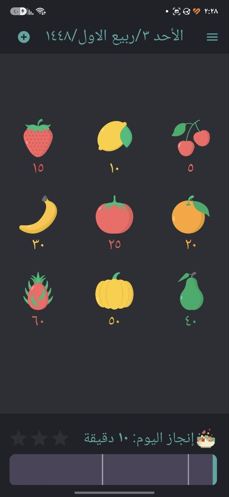
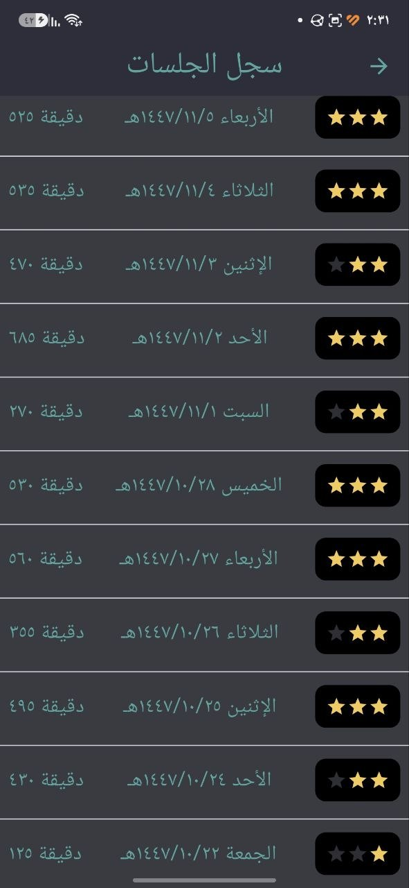
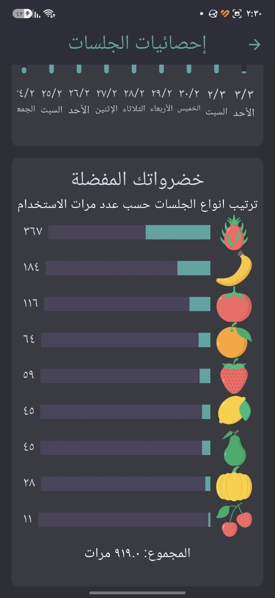
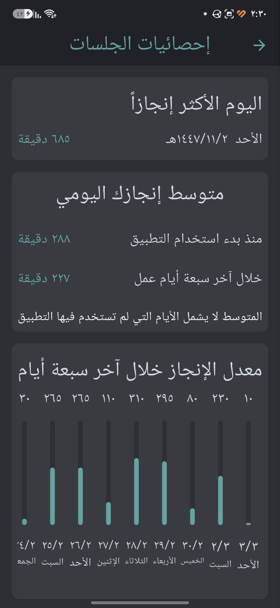
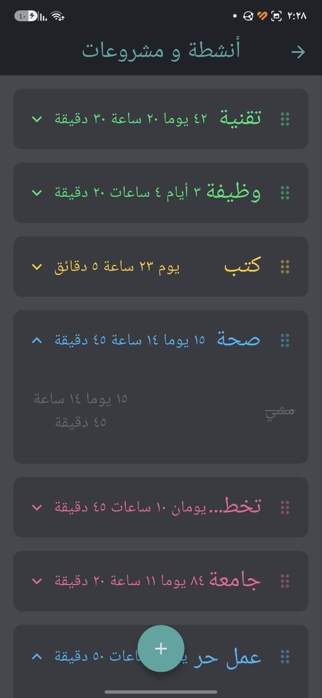
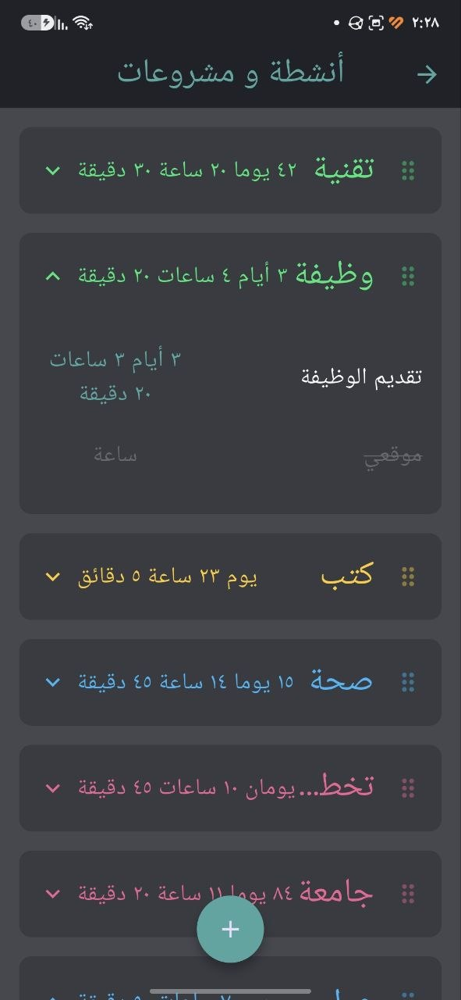
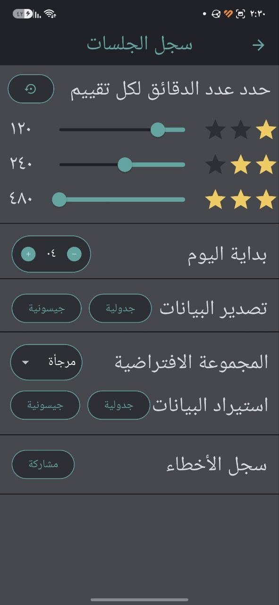

# Salad of Achievement — سلطة الإنجاز

**تطبيق محلي عالي الأداء لتتبع وإدارة جلسات التركيز والإنتاجية** 
*An offline-first, high-performance focus timer and productivity tracking application.*

 

### لقطات الشاشة / App Screenshots

<table>
 <tr>
 <td align="center"><b>العداد الرئيسي Main Focus Timer</b></td>
 <td align="center"><b>سجل الجلسات Session History</b></td>
 <td align="center"><b>لوحة الإحصائيات Analytics Dashboard</b></td>
 <td align="center"><b>مؤشرات الإنجاز Productivity Metrics</b></td>
 </tr>
 <tr>
 <td align="center"></td>
 <td align="center"></td>
 <td align="center"></td>
 <td align="center"></td>
 </tr>
 <tr>
 <td align="center"><b>إدارة الأنشطة Activity List</b></td>
 <td align="center"><b>الأرشيف والتصنيف Activity Archive</b></td>
 <td align="center" colspan="2"><b>إعدادات النجوم Star Settings</b></td>
 </tr>
 <tr>
 <td align="center"></td>
 <td align="center"></td>
 <td align="center" colspan="2"></td>
 </tr>
</table>

---

## Arabic / العربية 

### تطبيق سلطة الإنجاز — Salad of Achievement
تطبيق محلي مبني باستخدام [Flutter](https://flutter.dev) لإدارة وتتبع جلسات التركيز والإنتاجية، وهو تطوير لـ **"[سلطة الإنجاز لعلي محمد علي](https://www.youtube.com/@AliMuhammadAli)"**. يهدف التطبيق إلى مساعدة المستخدمين على تقسيم أوقات العمل إلى كتل زمنية مرئية، ومتابعة الأهداف اليومية بالتقويم الهجري ونظام النجوم اليومية.

### ملاحظة حول التطوير
تم بناء التطبيق ليعمل بكفاءة وسرعة فائقة بدون اتصال بالإنترنت (Offline-First)، مع التركيز على:
* **دقة المؤقت في الخلفية** حتى عند إغلاق التطبيق.
* **سرعة الاستجابة اللحظية** باستخدام قاعدة بيانات NoSQL محلية ([ObjectBox](https://objectbox.io)).
* **دعم أصيل وكامل** للتقويم الهجري وتنسيق الأرقام.
* **القدرة على تعديل المهام** وأسمائها وتصانيفها وأرشفتها لوقت لاحق.
* **تصدير البيانات** كملفات [JSON](https://www.json.org) أو جداول [CSV](https://en.wikipedia.org/wiki/Comma-separated_values).

### المميزات الأساسية
* **مؤقت الفاكهة للتركيز:** واجهة عداد تنازلي مرئية لاختيار جلسات العمل (من 5 إلى 60 دقيقة) مع استئناف فوري من الخلفية. [(عرض الشاشة)](assets/screenshots/photo_7.jpg)
* **شريط الإنجاز اليومي ومستويات النجوم:** شريط تقدم تفاعلي لحساب الدقائق المنجزة يومياً وتتبع تحقيق النجوم الثلاثة (Star 1, Star 2, Star 3). [(عرض الشاشة)](assets/screenshots/photo_2.jpg)
* **إدارة الأنشطة والمشاريع:** إنشاء وتصنيف الأنشطة ضمن مجموعات، مع إمكانية أرشفة الأنشطة وحساب الوقت المستغرق لكل مشروع. [(عرض الشاشة)](assets/screenshots/photo_4.jpg)
* **سجل الجلسات والتقويم الهجري:** استعراض وتعديل الجلسات السابقة مجمعة تلقائياً بالأيام الهجرية. [(عرض الشاشة)](assets/screenshots/photo_1.jpg)
* **لوحة الإحصائيات:** رسوم بيانية ومؤشرات لتتبع متوسط الإنتاجية اليومية والأيام الأكثر إنجازاً. [(عرض الشاشة)](assets/screenshots/photo_3.jpg) [(المؤشرات)](assets/screenshots/photo_6.jpg)
* **تنبيهات وإشعارات مخصصة:** إشعارات فورية بنغمات مخصصة تعمل بكفاءة حتى في وضع خمول الجهاز.
* **تصدير واستيراد البيانات:** دعم كامل للنسخ الاحتياطي بصيغة JSON وتصدير سجل الجلسات إلى ملفات CSV.
* **قاعدة بيانات فائقة السرعة:** حفظ محلي بدون أي تأخير زمني باستخدام [ObjectBox DB](https://pub.dev/packages/objectbox).

### التقنيات المستخدمة
* **Framework:** [Flutter](https://flutter.dev) ([Dart SDK ^3.9.0](https://dart.dev))
* **State Management:** [Provider](https://pub.dev/packages/provider)
* **Local Database:** [ObjectBox NoSQL DB](https://pub.dev/packages/objectbox)
* **Notifications:** [Awesome Notifications](https://pub.dev/packages/awesome_notifications)
* **Calendar:** [Hijri Calendar](https://pub.dev/packages/hijri)
* **Data Handling:** [CSV](https://pub.dev/packages/csv), [File Picker](https://pub.dev/packages/file_picker)

### الخصوصية
التطبيق يعمل محلياً بالكامل ولا يقوم بجمع أو مشاركة أي بيانات شخصية، وتظل كافة الجلسات والإحصائيات محفوظة حصرياً على جهازك.

### المساهمة
المساهمات البرمجية والاقتراحات مرحب بها دائماً. يمكنك فتح [Issue](https://github.com/BaselCS/salad_of_achievement/issues) أو إرسال [Pull Request](https://github.com/BaselCS/salad_of_achievement/pulls) للمساهمة في تطوير المشروع.

### الترخيص
هذا المشروع مرخص تحت رخصة [MIT License](LICENSE).

---

## English 

### Salad of Achievement App
An offline-first, high-performance focus timer and productivity tracking application built with [Flutter](https://flutter.dev), inspired by and expanding on the **"[Salad of Achievement](https://www.youtube.com/@AliMuhammadAli)"** methodology by [Ali Muhammad Ali](https://www.youtube.com/@AliMuhammadAli). The app aims to help users divide work intervals into visual time blocks and monitor daily goals using the Hijri calendar alongside a daily star milestone system.

### Development Notes
Engineered to operate with high efficiency and ultra-fast performance fully offline:
- **Background timer precision**, even when the application is closed.
- **Instantaneous responsiveness** powered by a local NoSQL database ([ObjectBox](https://objectbox.io)).
- **Native and complete support** for the Hijri calendar and numeral formatting.
- **Full flexibility** to edit tasks, names, categories, and archive them for later use.
- **Seamless data export capabilities**, supporting both [JSON](https://www.json.org) and spreadsheet ([CSV](https://en.wikipedia.org/wiki/Comma-separated_values)) formats.

### Core Features
- **Fruit-Themed Focus Timer:** A visual countdown interface to select work sessions (ranging from 5 to 60 minutes) with instant background resumption. [(View Screen)](assets/screenshots/photo_7.jpg)
- **Daily Achievement Bar & Star Milestones:** An interactive progress bar tracking completed daily minutes and progress toward achieving the three milestone levels (Star 1, Star 2, Star 3). [(View Screen)](assets/screenshots/photo_2.jpg)
- **Activity & Project Management:** Create and organize activities into groups, with full support for archiving tasks and calculating total time spent per project. [(View Screen)](assets/screenshots/photo_4.jpg) [(Archive)](assets/screenshots/photo_5.jpg)
- **Session History & Hijri Calendar:** Review and edit historical sessions, automatically organized by Hijri dates. [(View Screen)](assets/screenshots/photo_1.jpg)
- **Analytics Dashboard:** Visual charts and metrics to track average daily productivity and identify top-performing days. [(View Screen)](assets/screenshots/photo_3.jpg) [(Metrics)](assets/screenshots/photo_6.jpg)
- **Custom Alerts & Notifications:** Instant notifications with custom audio tones that trigger reliably even during device idle states.
- **Data Export & Import:** Full backup support via JSON and session log exports to CSV files.
- **Ultra-Fast Database:** Zero-latency local data persistence powered by [ObjectBox DB](https://pub.dev/packages/objectbox).

### Tech Stack
- **Framework:** [Flutter](https://flutter.dev) ([Dart SDK ^3.9.0](https://dart.dev))
- **State Management:** [Provider](https://pub.dev/packages/provider)
- **Local Database:** [ObjectBox NoSQL DB](https://pub.dev/packages/objectbox)
- **Notifications:** [Awesome Notifications](https://pub.dev/packages/awesome_notifications)
- **Calendar:** [Hijri Calendar](https://pub.dev/packages/hijri)
- **Data Handling:** [CSV](https://pub.dev/packages/csv), [File Picker](https://pub.dev/packages/file_picker)

### Privacy
The application operates entirely offline and does not collect or share any personal data. All sessions and statistics remain stored exclusively on your device.

### Contributing
Contributions and suggestions are always welcome. Feel free to open an [Issue](https://github.com/BaselCS/salad_of_achievement/issues) or submit a [Pull Request](https://github.com/BaselCS/salad_of_achievement/pulls) to help improve the project.

### License
This project is licensed under the [MIT License](LICENSE).